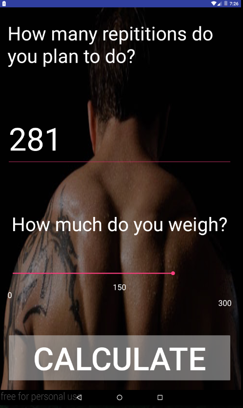

# PROG 01: Crunch Time

Briefly describe your app here.

## Authors
Arman Jaffer 
([arman@berkeley.edu](mailto:arman@berkeley.edu))

## Demo Video

See [Crunch Time] (/Users/Arman/AndroidStudioProjects/CrunchTime)

## Screenshots

## Acknowledgments

* Hat tip to anyone who's code was used
* Any other support

*Feel free to enhance your README. For Markdown syntax, see [the GitHub Guides](https://guides.github.com/features/mastering-markdown/). Remove this line in your submission.*
